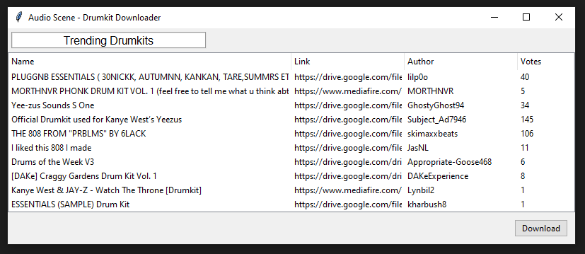

<!-- PROJECT LOGO -->

<!--
  
-->

  

  <h1>Drumkits Pro</h1>
  
  The Only [r/Drumkits](https://www.reddit.com/r/Drumkits/) Downloader
 

  

<!--
    
<a href="https://jesusyanez.github.io/Techline/"><strong>Windows Download »</strong></a> * <a href="https://jesusyanez.github.io/Techline/"><strong>Linux Download »</strong></a>

  

-->

<!-- ABOUT THE PROJECT -->

<h2>Features</h2>

* Download one of multiple drumkits
* Automatic file unzipping
* Downloads to selected folder
* Supports all operating systems
* Made with Python 3 

### Downloads from:
- [X] Google Drive
- [X] Dropbox
- [X] MediaFire
- [X] WeTransfer

## Roadmap
- [X] RAR extraction
- [X] Expand support
  - [X] Dropbox
  - [X] Mediafire
  - [X] WeTransfer
- [X] GUI
  - [X] General layout
  - [X] Reformat code to work with GUI
- [ ] Easy to install .EXE

<!--
## Usage
-->

<!-- LICENSE 
## License

Distributed under the GPL-3.0 License. See `LICENSE.txt` for more information.

(<a href="#top">back to top</a>)
 -->

<!-- ACKNOWLEDGMENTS -->
<!-- ## Acknowledgments

* [PRAW  (Python Reddit API Wrapper)](https://praw.readthedocs.io/en/stable/)
* [PANDAS](https://pandas.pydata.org/)

(<a href="#top">back to top</a>)
 -->
